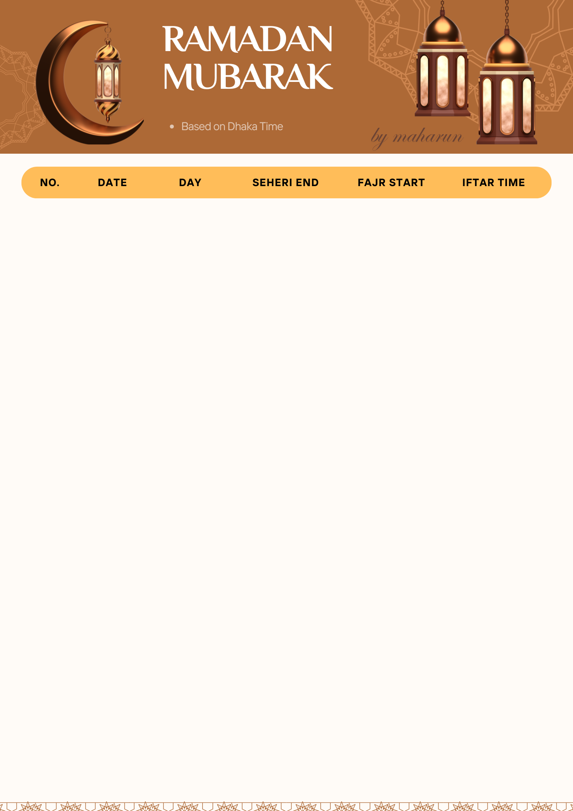
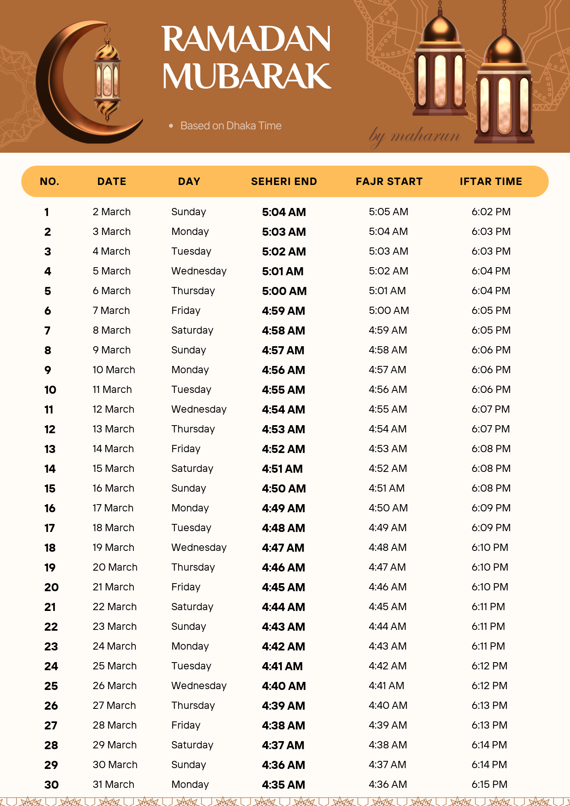

# Ramadan Timetable Generator

The Ramadan Timetable Generator allows you to automatically generate a Ramadan timetable using a customizable image template and CSV data.

You can also specify what type font you want to use and also customize all sort of stuffs.

### Input
- Template Image
- CSV Data
- Fonts (.ttf / .otf)

### Output
- Desired Image (or here timetable)

| Template Image  |   →   |  Ramadan Timetable  |
|---------|------|---------|
|  | |  |

## How to run?
- Customize(if you wnat) variable names in main.py
- run `python main.py` command in the terminal.

### Timetable Source
[Timetable Source Link](https://inews.zoombangla.com/ramadan-calendar-2025/)